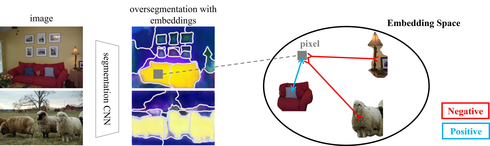
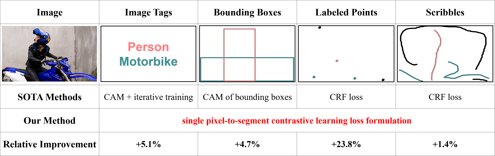

# Universal Weakly Supervised Segmentation by Pixel-to-Segment Contrastive Learning
By [Tsung-Wei Ke](https://www1.icsi.berkeley.edu/~twke/), [Jyh-Jing Hwang](https://jyhjinghwang.github.io/), and [Stella X. Yu](http://www1.icsi.berkeley.edu/~stellayu/)





Weakly supervised segmentation requires assigning a label to every pixel based on training instances with partial annotations such as image-level tags, object bounding boxes, labeled points and scribbles. This task is challenging, as coarse annotations (tags, boxes) lack precise pixel localization whereas sparse annotations (points, scribbles) lack broad region coverage. Existing methods tackle these two types of weak supervision differently: Class activation maps are used to localize coarse labels and iteratively refine the segmentation model, whereas conditional random fields are used to propagate sparse labels to the entire image.

We formulate weakly supervised segmentation as a semi-supervised metric learning problem, where pixels of the same (different) semantics need to be mapped to the same (distinctive) features. We propose 4 types of contrastive relationships between pixels and segments in the feature space, capturing low-level image similarity, semantic annotation, co-occurrence, and feature affinity They act as priors; the pixel-wise feature can be learned from training images with any partial annotations in a data-driven fashion. In particular, unlabeled pixels in training images participate not only in data-driven grouping within each image, but also in discriminative feature learning within and across images. We deliver a universal weakly supervised segmenter with significant gains on Pascal VOC and DensePose. 


## Code Base
This release of code is based on [SegSort](https://github.com/jyhjinghwang/SegSort) in ICCV 2019.

### Prerequisites

1. Linux
2. Python3 (>=3.5)
3. Cuda >= 9.2 and Cudnn >= 7.6

### Required Python Packages

1. pytorch >= 1.6
2. numpy
3. scipy
4. tqdm
5. easydict == 1.9
6. PyYAML
7. PIL
8. opencv
9. pydensecrf

## Data Preparation

### Pascal VOC 2012

1. Augmented Pascal VOC training set by [SBD](http://home.bharathh.info/pubs/codes/SBD/download.html). [Download link](https://github.com/jyhjinghwang/SegSort/blob/master/dataset/voc12/sbd_clsimg.zip) provided by [SegSort](https://github.com/jyhjinghwang/SegSort). Please unzip it and put it besides the VOC2012/ folder as sbd/dataset/clsimg/.
2. Ground-truth semantic segmentation masks are reformatted as grayscale images. [Download link](https://www.dropbox.com/sh/fd2m7s87gk7jeyh/AAC6tN6syhFKmEaDYCwUIgnXa?dl=0) provided by [SegSort](https://github.com/jyhjinghwang/SegSort).
3. The over-segmentation masks are generated by combining contour detectors with gPb-owt-ucm. [HED-owt-ucm masks](https://www.dropbox.com/sh/fd2m7s87gk7jeyh/AAC6tN6syhFKmEaDYCwUIgnXa?dl=0) provided by [SegSort](https://github.com/jyhjinghwang/SegSort).
4. Scribble and point annotations by [ScribbleSup](https://jifengdai.org/downloads/scribble_sup/). We follow ["Regularized Losses for Weakly-supervised CNN Segmentation"](https://github.com/meng-tang/rloss/blob/master/data/pascal_scribble/convertscribbles.m) to process scribble annotations. You can download the processed ground-truth scribble([100%](https://drive.google.com/file/d/1R25yksUYCo59ljtuXxC9l2cd6iZFsjpW/view?usp=sharing), [80%](https://drive.google.com/file/d/1A8mAFya8o22bKO-3yQuBPJR_Ki-4NFCO/view?usp=sharing), [50%](https://drive.google.com/file/d/1d38S_K-y3oLUtNAa2IcjuJsmjzyEus40/view?usp=sharing) and [30%](https://drive.google.com/file/d/1cV19sv0JHxEi95dUr-_fF3oXUbMztwf3/view?usp=sharing)) and [point](https://drive.google.com/file/d/13CsLen7i8aHCXpqnjkHcjrpX5wAcVJLl/view?usp=sharing) annotations, and put them under VOC2012/scribble folder. For scribbles, we set dilation size to 3; For points, we set dilation size to 6.
5. Cam annotations by [SEAM](https://github.com/YudeWang/SEAM). You can download the processed CAMs for [image tag](https://drive.google.com/file/d/1bIHgMfzfiewabO57SJXA6IorknpVQUk-/view?usp=sharing) and [bounding box](https://drive.google.com/file/d/1zhGAqNc3OguUfmipOyYnaXERbAwv3T_S/view?usp=sharing) annotations, and put them under VOC2012/cam. For image tags, we set `alpha` to 6 and probability threshold to 0.2. Pixels with probability less than 0.2 are considered as unlabeled regions. For bounding boxes, we normalize CAM to the range of 0 and 1 within each box, and set the probability threshold to 0.5. The pixel labels outside the boxes as background class.
6. Dataset layout:
```
   $DATAROOT/
       |-------- sbd/
       |          |-------- dataset/
       |                       |-------- clsimg/
       |
       |-------- VOC2012/
                  |-------- JPEGImages/
                  |-------- segcls/
                  |-------- hed/
                  |-------- scribble/
                  |            |-------- dilate_3/
                  |            |-------- dilate_6_0.0/
                  |
                  |-------- cam/
                               |-------- seam_a6_th0.2/
                               |-------- seambox_a6_th0.5/
```

### DensePose

1. Images from [MSCOCO](https://cocodataset.org). Download 2014 Train and Val Images ([here](https://cocodataset.org/#download)).
2. Ground-truth semantic segmentation by [DensePose](http://densepose.org/). You can download the processed ground-truth segmentation [here](https://drive.google.com/file/d/1vNGgamOjw7J0p8AAASy9igVpUCDjvytb/view?usp=sharing), and put them under segcls/ folder.
3. Ground-truth point annotation [here](https://drive.google.com/file/d/17zH3OFKXEr9y0QWNYP-9ry22SkhmhEmt/view?usp=sharing). Put them under segcls/ folder.
4. The over-segmentation masks by [PMI](http://web.mit.edu/phillipi/pmi-boundaries/) and gPb-owt-ucm. Download [PMI-owt-ucm masks](https://drive.google.com/file/d/1KZEEyZJBfTQYS63DkdasY4-DnFiFCBHN/view?usp=sharing) and put them under seginst/ folder.
5. Dataset layout:
```
   $DATAROOT/
       |-------- images/
       |          |-------- train2014/
       |          |-------- val2014/
       |
       |-------- segcls/
       |          |-------- densepose/gray/
       |          |-------- densepose_points/gray/
       |
       |-------- seginst/
                  |-------- pmi_0.1_256/
```


### ImageNet Pre-Trained Models
We use the same ImageNet pretrained ResNet101 as [EMANet](https://github.com/XiaLiPKU/EMANet). You can download the pretrained models [here](https://drive.google.com/file/d/1I5WIu8jHQF-BksWiMrttiuNp1JnyRslh/view?usp=sharing) and put it under a new directory SPML/snapshots/imagenet/trained/. **Note: we do not use MSCOCO pretrained ResNet.**

### Pascal VOC 2012 Trained Models.
We provide the download links for our SPML models trained using image-level tag/bounding box/scribble/point annotations on PASCAL VOC, and summarize the performance as follows. **Note: we report the performance with denseCRF post-processing.**

| Annotations   |      val      |     test      |
| ------------- | ------------- | ------------- |
|  [Image Tags](https://drive.google.com/file/d/1lLgpINx2vm1s2Gkq_S4TAg9tmUOvI0XL/view?usp=sharing)   |     69.5      |      71.6        |
| [Bounding Box](https://drive.google.com/file/d/1uZBPKJRHXPBkNdALXfBoXLSwUmub8G0s/view?usp=sharing)  |     73.5      |      74.7        |
| [Scribbles](https://drive.google.com/file/d/1uU7l9BWC2BaQQk50vp3tF-u72jM9iQJW/view?usp=sharing)  |     76.1      |      76.4        |
| [Points](https://drive.google.com/file/d/1kgYItTXZS2p6vL4xHU1JEpspSbt0Lau6/view?usp=sharing)  |     73.2     |      74.0        |

### DensePose Trained Models.

We provide the download link for our SPML models trained using point annotations on DensePose [here](https://drive.google.com/file/d/1NVBf0rQJjsLryNow7ne_wtKUHCR0nuFF/view?usp=sharing). We achieve 44.15% of mIoU on minival2014 set.

## Bashscripts to Get Started

### Pascal VOC 2012

* SPML with image-level tag.
```
source bashscripts/voc12/train_spml_tag.sh
```

* SPML with bounding box.
```
source bashscripts/voc12/train_spml_box.sh
```

* SPML with scribbles.
```
source bashscripts/voc12/train_spml_scribble.sh
```

* SPML with points.
```
source bashscripts/voc12/train_spml_point.sh
```

### DensePose

* SPML with points.
```
source bashscripts/densepose/train_spml_point.sh
```

## Citation

If you find this code useful for your research, please consider citing our paper Universal Weakly Supervised Segmentation by Pixel-to-Segment Contrastive Learning.
```
@inproceedings{ke2021spml,
  title={Universal Weakly Supervised Segmentation by Pixel-to-Segment Contrastive Learning},
  author={Ke, Tsung-Wei and Hwang, Jyh-Jing and Yu, Stella X},
  booktitle={International Conference on Learning Representations},
  pages={},
  year={2021}
}
```

## License

SPML is released under the MIT License (refer to the LICENSE file for details).
